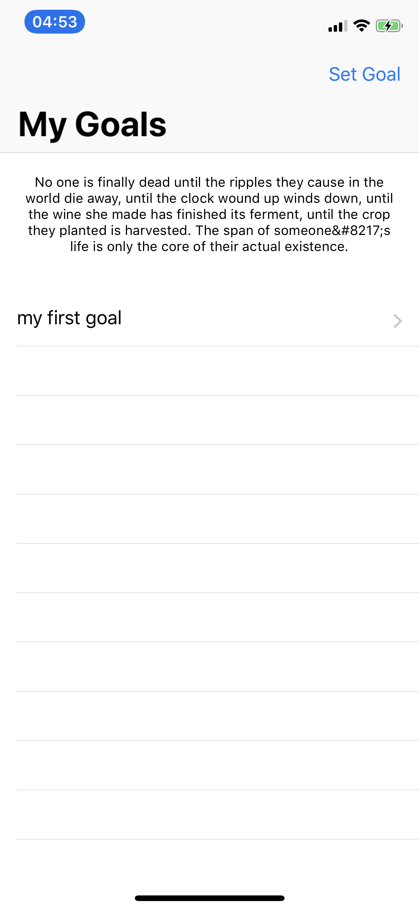
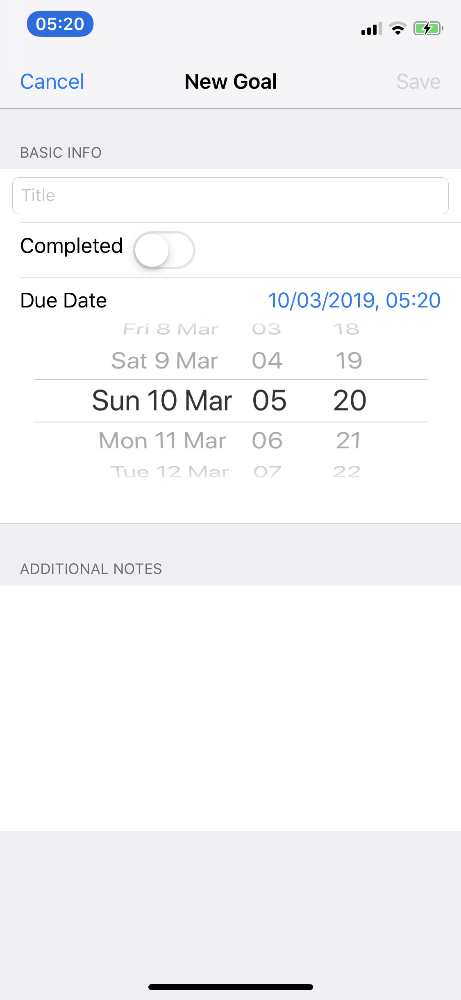
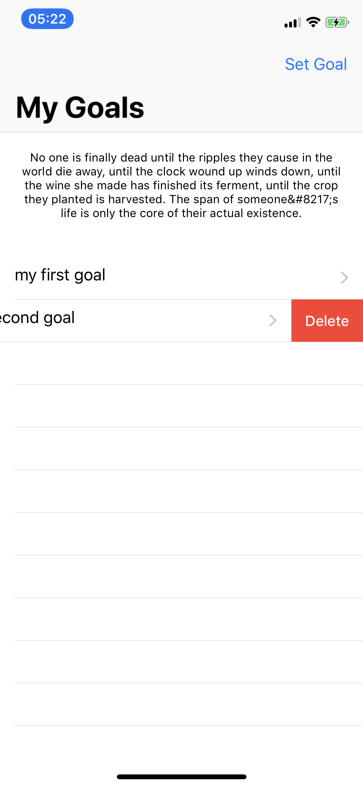

# Goals-App
This is a simpele IOS(Swift) Goal setting application. The app allows you to create and manage your primary goals, then create targets as mini goals to help you achive your primary goals. It also encourages you by providing a new and inspiring qoute every time you load the app.

#Application Basics

Initial view displays your goals in a table view, top navigation allows you to set a new goal. Clicking on your goal allows yout to set targets towards your primary goals. They are ordered by closest deadline to furthest deadline.

To add a new goal you must first set a title of a minimum of 1 character then the save button will appear. You can also provide additional notes and goals. 

Goals and targets can both be deleted by swiping, from right to left. If you swipe parcially then you will have to tap the delete button if you swipe the whole way the row will be deleted.

Targets are small reminders of task's that need to be acomplished to achive your goals. 

# Libarys/API

This app uses the <a href="http://quotesondesign.com">Quotesondesign API</a> To provide users with motivational inspirationals qoutes. 

It's built in swift utalisting UIKit and Coredate libarys

# Install

Clone/downlaod the github repository into a file location with terminal. 
git clone https://github.com/jacksanderson123/Note-Taking-App.git 

Once in xCode go to..
- Protivity.xcodeproj 
- Change team under signing

Requirements
- IOS 12 device or simulator
- Xcode 10 or higher
- Swift version 4 or higher

# Known Bugs
Sometimes the quote will be provided with special character code, html is removed with reg-ex. 
